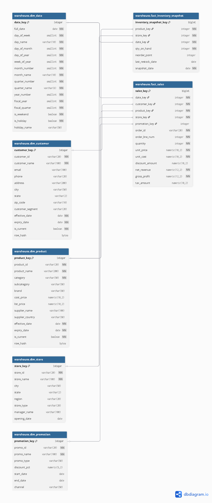

# RetailCo Analytical Data Warehouse

## Dimensional Model Design Document
---

## 1. Business Context

RetailCo is a multi-channel retail company with operations across 5 regions. The OLTP system serves day-to-day operations but analysts face several pain points:

- Complex multi-join queries running 20+ minutes
- No historical tracking when product prices or customer addresses change
- Inconsistent metric definitions across reports
- No standard date dimension for fiscal calendar reporting

The analytical warehouse solves these problems by implementing a **star schema** following **Kimball dimensional modeling methodology**.

---

## 2. Business Processes Modeled

| # | Business Process | Grain | Fact Table |
|---|---|---|---|
| 1 | Sales Transactions | One row per order line item | `fact_sales` |
| 2 | Inventory Snapshots | One row per product per store per day | `fact_inventory_snapshot` |

---

## 3. Source System

**8 OLTP source tables in `public` schema:**

| Table | Description |
|---|---|
| `orders` | Transaction header — order_id, customer, date, store, status |
| `order_items` | Transaction line items — product, quantity, price, discount |
| `customers` | Customer master — name, address, contact details |
| `products` | Product master — category, brand, cost, price, supplier |
| `stores` | Store master — location, region, type, manager |
| `suppliers` | Supplier master — name, country, lead time |
| `promotions` | Promotion master — type, discount, validity window |
| `inventory` | Stock levels — quantity on hand, reorder point per store/product |

---

## 4. Dimensional Model — Star Schema

```
                    ┌─────────────────┐
                    │   dim_customer   │
                    │   (SCD Type 2)  │
                    └────────┬────────┘
                             │ customer_key
                             │
┌─────────────┐    ┌─────────▼──────────┐    ┌──────────────┐
│  dim_date   │    │                    │    │  dim_product  │
│ (Generated) ├────►    fact_sales      ◄────┤  (SCD Type 2)│
└──────┬──────┘    │                    │    └──────────────┘
       │           │  sales_key    (PK) │    product_key
       │           │  date_key     (FK) │
       │           │  customer_key (FK) │
       │           │  product_key  (FK) │
       │           │  store_key    (FK) │
       │           │  promotion_key(FK) │    ┌──────────────┐
       │           │  [measures]        ◄────┤  dim_store   │
       │           └────────────────────┘    │  (SCD Type 1)│
       │                                     └──────┬───────┘
       │                                            │ store_key
       │           ┌────────────────────┐           │
       │           │                    │           │
       └───────────► fact_inventory     ◄───────────┘
                   │    _snapshot       │
                   │                    ◄────┤  dim_product  │
                   │  snapshot_key (PK) │    (shared dimension)
                   │  date_key     (FK) │
                   │  product_key  (FK) │
                   │  store_key    (FK) │
                   │  qty_on_hand       │
                   │  reorder_point     │
                   │  last_restock_date │
                   │  snapshot_date     │
                   └────────────────────┘
```
 ### Visual Diagram



---

## 5. Fact Table Design

### `fact_sales`

| Attribute | Value |
|---|---|
| **Grain** | One row per order line item |
| **Schema** | `warehouse` |
| **SCD Type** | N/A — facts are immutable |
| **Primary Key** | `sales_key` (surrogate, BIGINT) |

**Measures:**

| Column | Type | Description |
|---|---|---|
| `quantity` | INTEGER | Units purchased — fully additive |
| `unit_price` | NUMERIC(10,2) | Selling price per unit |
| `unit_cost` | NUMERIC(10,2) | Cost per unit from supplier |
| `discount_amount` | NUMERIC(10,2) | Total discount applied |
| `net_revenue` | NUMERIC(12,2) | Revenue after discount — primary metric |
| `gross_profit` | NUMERIC(12,2) | net_revenue minus cost |
| `tax_amount` | NUMERIC(10,2) | Tax at 8% of net_revenue |

**Degenerate Dimension:**  
`order_id` is stored directly in the fact table as a degenerate dimension. This allows drill-back to the source transaction without creating a separate `dim_order` table.

### `fact_inventory_snapshot`

| Attribute | Value |
|---|---|
| **Grain** | One row per product per store per day |
| **Schema** | `warehouse` |
| **SCD Type** | N/A — snapshot pattern, immutable rows |
| **Primary Key** | `inventory_snapshot_key` (surrogate, BIGINT) |
| **Grain Constraint** | `UNIQUE (product_key, store_key, date_key)` |

**Measures:**

| Column | Type | Description |
|---|---|---|
| `qty_on_hand` | INTEGER | Stock units available at snapshot time |
| `reorder_point` | INTEGER | Minimum stock level before reorder triggered |
| `last_restock_date` | DATE | Date stock was last replenished — attribute |
| `snapshot_date` | DATE | CURRENT_DATE at load time — direct date access |

**Design note:** `snapshot_date` and `date_key` both represent the same date. `date_key` enables joins to `dim_date` for fiscal calendar and weekend analysis. `snapshot_date` provides a direct DATE column for simple filters without joining.

---

### `dim_date` — Generated

| Attribute | Value |
|---|---|
| **SCD Type** | N/A — generated, immutable |
| **Range** | 2020-01-01 to 2030-12-31 |
| **Row Count** | 4,018 |
| **Fiscal Year** | Starts July 1 |

### `dim_customer` — SCD Type 2

| Attribute | Value |
|---|---|
| **SCD Type** | Type 2 — full history tracking |
| **Natural Key** | `customer_id` |
| **Surrogate Key** | `customer_key` (IDENTITY) |
| **Change Detection** | MD5 hash of: name, email, address, city, state |
| **Active Record** | `is_current = TRUE` |
| **Expiry Convention** | `expiry_date = 9999-12-31` for current records |

**Segment derivation logic:**
```
total_spend >= 10,000 → Gold
total_spend >= 5,000  → Silver
total_spend < 5,000   → Bronze
```

### `dim_product` — SCD Type 2

| Attribute | Value |
|---|---|
| **SCD Type** | Type 2 — full history tracking |
| **Natural Key** | `product_id` |
| **Surrogate Key** | `product_key` (IDENTITY) |
| **Change Detection** | MD5 hash of: name, category, subcategory, brand, cost, list_price, supplier_name, supplier_country |
| **Design Decision** | Supplier attributes denormalised into dim_product to maintain star schema and avoid dim_supplier snowflake |

### `dim_store` — SCD Type 1

| Attribute | Value |
|---|---|
| **SCD Type** | Type 1 — overwrite, no history |
| **Natural Key** | `store_id` (UNIQUE constraint) |
| **Surrogate Key** | `store_key` (IDENTITY) |
| **Load Pattern** | `INSERT ... ON CONFLICT (store_id) DO UPDATE` |

### `dim_promotion` — SCD Type 1

| Attribute | Value |
|---|---|
| **SCD Type** | Type 1 — overwrite, no history |
| **Natural Key** | `promo_id` (UNIQUE constraint) |
| **Surrogate Key** | `promotion_key` (IDENTITY) |
| **Load Pattern** | `INSERT ... ON CONFLICT (promo_id) DO UPDATE` |
| **Nullable FK** | `promotion_key` is nullable in `fact_sales` — not every sale has a promotion |

---

## 7. Surrogate Key Strategy

All dimension tables use `GENERATED ALWAYS AS IDENTITY` as surrogate keys. Natural keys are preserved as regular columns.

**Why surrogate keys:**
- Source system natural keys can change, be reused, or conflict across systems
- SCD Type 2 requires multiple rows per entity — each version needs a unique key
- Integer surrogate keys produce smaller, faster joins than natural VARCHAR keys
- Warehouse controls its own identity, independent of any source system

---

## 8. Schema Design Decisions

| Decision | Choice | Reason |
|---|---|---|
| Schema for dimensions/facts | `warehouse` | Separates analytical layer from OLTP (`public`) and staging. Challenge file specifies target as "analytical data warehouse" — dedicated schema enforces this separation |
| Star vs Snowflake | Star schema | Simpler queries, better performance — Kimball recommendation per session file |
| Supplier as dimension | Denormalised into dim_product | Avoids snowflake, maintains star schema. Supplier attributes tracked via SCD Type 2 on dim_product |
| Promotion FK nullable | Yes | Not every sale has a promotion — NULL is correct, not a missing value |
| Staging schema | Separate from Month 1 staging | Clean separation — Month 2 staging mirrors new OLTP source tables |
| `store_id` added to orders | Extra column beyond challenge file spec | Challenge file `fact_sales` requires `store_key` FK but original `orders` definition has no `store_id`. Column added to enable correct store join in fact load script. Without it, store join produces cartesian product |
| Two fact tables | `fact_sales` + `fact_inventory_snapshot` | Challenge file explicitly requires both in Part 1 grain definition and states goal includes "inventory analytics" |

---